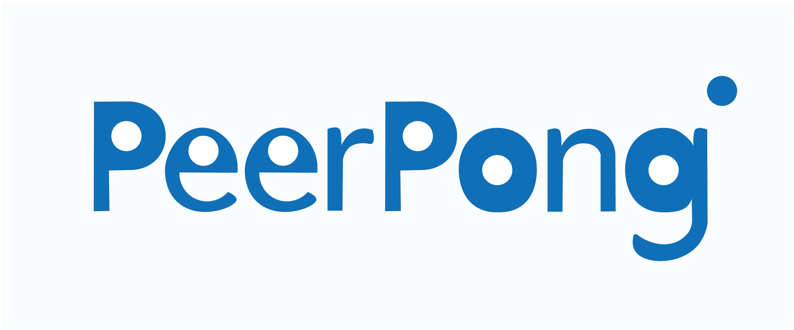

# PeerPong

## What is PeerPong?
PeerPong is a peer to peer online platform that allows you to create a video-conference with anyone in the world just sharing a link.
No need to download or install any software. Everything runs natively inside your browser.

PeerPong is platform and device independent, fast due to P2P and secure since all the communication is encrypted.

## Tech Stack

### Front-end:
* [WebRTC](https://webrtc.org/)
* [React](https://facebook.github.io/react-native/)
* [VanillaJS](https://redux.js.org/)

### Back-end

* [Node.js](https://nodejs.org/en/)
* [Express](https://expressjs.com/)
* [Redis](https://redis.io/)
* [Socket.io](https://socket.io/)
* [Heroku](https://www.heroku.com/)

## Screenshots
Coming Soon!

## Getting started
Coming Soon!

## Contributors
* Luca Panzavolta - [LucaPanzavolta](https://github.com/LucaPanzavolta)

As this is a 100% open source project all contributions and pull requests will be highly welcomed!